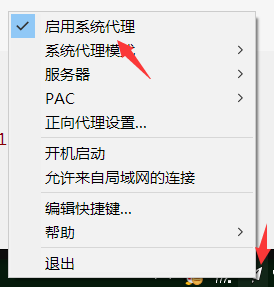

# 当前项目版本为: v1.0.1
**该项目仅供个人学习，请勿用于非法用途**

***别的版本 不再更新***

## 版本特性:

- 批处理可以切换shadowsocks服务器, 爬取shadowsocks对应服务器和密码进行翻墙

#### [1.使用](#user-content-使用)
#### [2.使用注意](#user-content-使用注意)
#### [3.版本介绍](#user-content-版本介绍)
#### [4.实现原因](#user-content-实现原因)

# 使用
    
    双击Main/Auto.bat即可使用

**为了便捷使用，可将创建该批处理快捷方式到桌面**
   
   
---
**注：**
记得shadowsocks.exe要启动系统代理

---

# 使用注意:

 - 仅适用windows环境

 - 代码适用需要配置python3.0以上的版本, [python下载地址](https://www.python.org/downloads/windows/)

 - python需要用到requests模块

     - 下载requests模块的方法如下:
     
在cmd输入以下即可:
         
> pip install requests
        

# 版本介绍
*本项目的版本, 第一个数字代表版本号，最后一个数字表示该版本的功能*
*比如v1.0.2表示使用2号功能的第一代版本*

**注:**

- 功能指如何运行该脚本
- 1号功能的批处理可以切换服务器**（推荐！！）**

- 2号功能的批处理为将脚本加入计划任务，使之每六小时自动重启脚本（实际服务器重启后还需要较长时间才能正常使用）

- 3号功能的批处理为直接运行脚本

### 当前可选择的版本
- v1.0.1
- v1.0.2
- v1.0.3

---

# 实现原因:
**因为[http://ss.ishadowx.com/](http://ss.ishadowx.com/)上的密码每6小时会更换(0点, 6点, 12点, 18点)并重启服务器,导致每次都要重新打开网页去找密码,所以做了以下程序,每次只需启动程序就会重新获取密码,并会自动打开shadowsocks,方便了使用**  

**从而实现需要科学上网时, 运行该项目代码即可科学上网** 

---

# 实现代码:

 - 代码分两部分: 
     - 第一部分api_shadowsocks.py为设计的api接口类
     - 第二部分shadowsocks.py是使用实例
     
 - api_shadowsocks
     - 主要函数 setShadowSocks(self, pattern):
     
         - 用于爬取 [http://ss.ishadowx.com/](http://ss.ishadowx.com/) 上的服务器,密码,端口,加密方式,并将其设置到shadowsocks.exe的配置文件中
         
     - 函数getHtml(self), 用于获取页面的内容
     
     - 函数printItem(self, pattern), 显示爬取的服务器,密码,端口,加密方式
         
# 实现思想(api_shadowsocks.py)
 - 爬取页面上的密码,服务器,端口,加密方式
 - 将爬取的信息设置到shadowsocks可执行程序的配置文件gui-config.json中
 - 判断shadowsocks.exe进程是否存在(因为一个目录下的shadowsocks.exe只能打开一个), 若存在, 则关闭.
 - 打开可执行程序shadowsocks.exe即可(记得启动系统代理)

